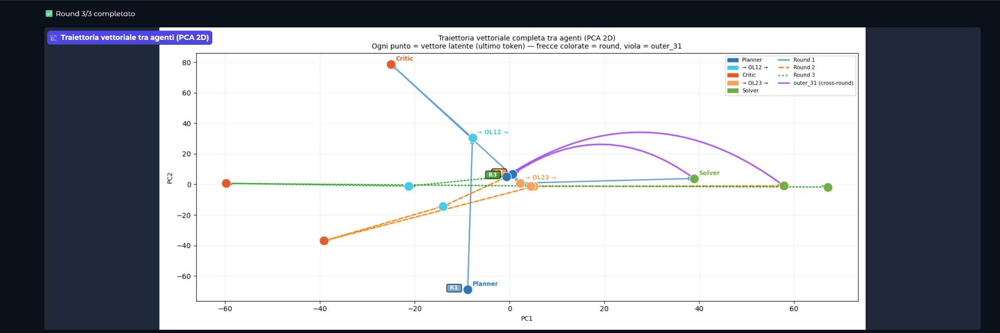
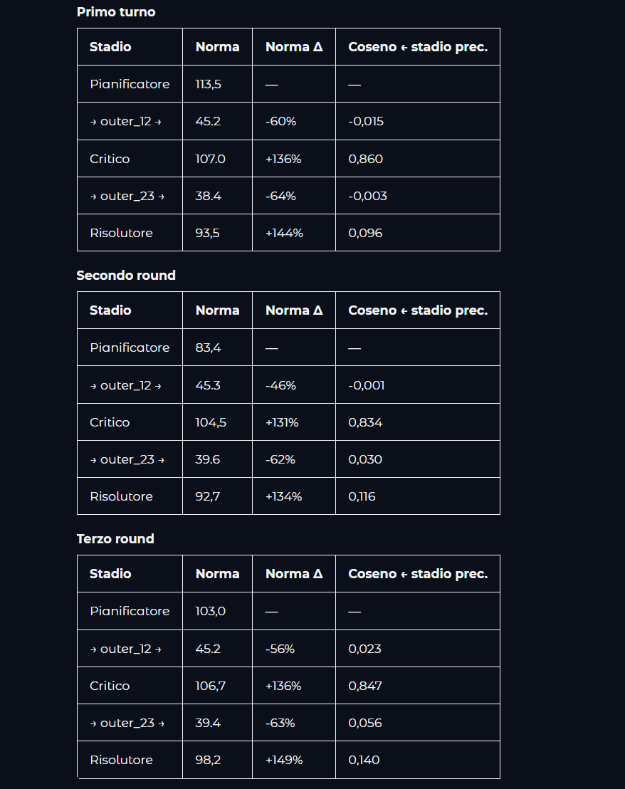

# RecursiveMAS Latent Visualizer

**Prima demo pubblica che rende visibile il ragionamento interno di un Multi-Agent System ricorsivo.**

Basato su [RecursiveMAS](https://arxiv.org/abs/2604.25917) — Stanford · UIUC · NVIDIA · MIT (aprile 2026).

---

## Demo

Apri il notebook su Google Colab (runtime A100 consigliato):

[](https://colab.research.google.com/github/AlexBenin01/LatentScope/blob/main/notebooks/day1_setup.ipynb)

---

## Screenshots

### Traiettoria vettoriale tra agenti — PCA 2D



Ogni punto è il vettore latente (ultimo token, ultimo layer) di un agente dopo quel round.
**Blu** = Planner · **Ciano** = OuterLink12 · **Arancio** = Critic · **Oro** = OuterLink23 · **Verde** = Solver
Le **frecce viola** mostrano il passaggio `outer_31`: Solver → Planner del round successivo.

---

### Statistiche pipeline — norma e cosine similarity



Norma L2 e cosine similarity ad ogni transizione tra agenti, per tutti e 3 i round.
Le OuterLinks hanno cosine ≈ 0 — proiettano in modo **ortogonale** tra spazi semantici diversi.

---

## Cosa fa

### Feature 1 — Monitor spazio latente

Inserisci una domanda. Il sistema esegue 3 round ricorsivi Sequential-Light:

```
Planner (Qwen3-1.7B)
  → outer_12 (2048→2048) ⊥
Critic (Llama3.2-1B)
  → outer_23 (2048→1536) ⊥
Solver (Qwen2.5-Math-1.5B)
  → outer_31 (1536→2048)
Planner round successivo...
```

**Visualizzazioni live dopo ogni round:**
- **PCA 2D Journey** — 15 punti (5 agenti × 3 round) con traiettorie colorate e frecce cross-round
- **Tabella statistiche** — norma L2, variazione %, cosine similarity con indicatore `⊥` per proiezioni ortogonali
- **Metriche Solver** — cosine similarity tra round, entropia, top-5 confidence

### Feature 2 — Expert (8B) vs Learner (1.7B)

Stesso problema, 3 round di raffinamento iterativo su due modelli di dimensione diversa.
Grafico delta live che mostra la convergenza del modello più piccolo verso quello grande.

---

## Scoperta emergente

Le OuterLinks proiettano con **cosine ≈ 0** tra agenti consecutivi — proiezione quasi ortogonale.

Non trasportano il significato: lo **trasformano completamente**. Ogni agente lavora in uno spazio semantico suo. Nessun lavoro precedente aveva visualizzato questo numericamente.

| Transizione | Round 1 | Round 2 | Round 3 |
|---|---|---|---|
| outer_12 cosine | -0.015 ⊥ | -0.001 ⊥ | +0.023 ⊥ |
| outer_23 cosine | -0.003 ⊥ | +0.030 ⊥ | +0.056 ⊥ |

---

## Setup locale

```bash
git clone https://github.com/AlexBenin01/LatentScope
cd LatentScope
pip install -r requirements.txt
python app.py   # GPU ≥ 10 GB VRAM per Feature 1
```

## Test (no GPU)

```bash
pytest tests/
```

---

## Paper originale

RecursiveMAS: Scaling Agent Collaboration through Latent-space Recursion
Yang et al., 2026 — [arXiv:2604.25917](https://arxiv.org/abs/2604.25917)
UIUC · Stanford University · NVIDIA · MIT

## Licenza

Apache 2.0
